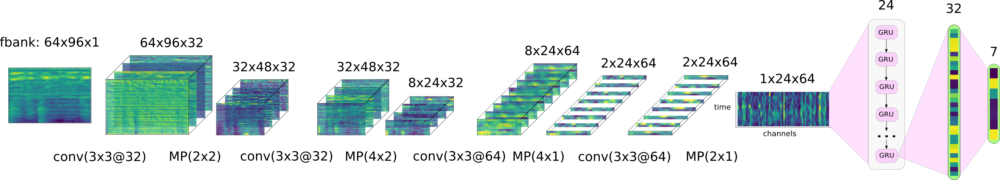
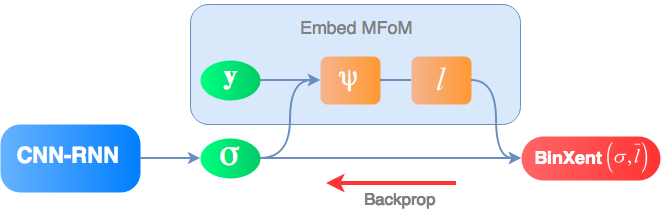

# Multi-label MFoM framework for DCASE 2016: Task 4


[The SIPU Lab / University of Eastern Finland](https://www.uef.fi/web/machine-learning) 

[Institute for Infocomm Research / A*Star / Singapore](https://www.a-star.edu.sg/i2r)

Author: **Ivan Kukanov**, [Email](mailto:ivan@kukanov.com), [Homepage](http://www.kukanov.com), [GitHub](https://github.com/vanova)

Supervisor: **Ville Hautamäki**, [Email](mailto:villeh@uef.fi), [Homepage](http://cs.joensuu.fi/~villeh/)
  
Description
===========
This framework represents the implementation of the [maximal figure-of-merit](http://cs.joensuu.fi/~villeh/MFoM-ICASSP2017.pdf) (MFoM) approach 
for multi-label tasks. In particular, it is applied to the [domestic audio tagging task](http://www.cs.tut.fi/sgn/arg/dcase2016/task-audio-tagging) 
 of the DCASE 2016: task 4 challenge. This project represents the solution for the problem of the domestic audio tagging, 
where one audio recording can contain one or more acoustic events and a recognizer
should output all of those tags. 

Organizers provided the baseline system [DCASE 2016 task 4 baseline](https://github.com/pafoster/dcase2016_task4/tree/master/baseline)
with the basic approach: MFCC-based acoustic features and a GMM-based classifier.
Our baseline model is a *convolutional recurrent neural network* (CRNN)
with sigmoid output units optimized using the binary cross-entropy (BCE)
objective. We embed maximal figure-of-merit approach into the deep
learning objective function and gain more than 10% relative
improvement, compared to the baseline model with the binary
cross-entropy.

The proposed MFoM approaches are used in the series of works

* [Maximal Figure-of-Merit Embedding for Multi-label Audio Classification](http://cs.joensuu.fi/~villeh/MFoM-ICASSP2017.pdf)
* [Recurrent Neural Network and Maximal Figure of Merit for Acoustic Event Detection](http://www.cs.tut.fi/sgn/arg/dcase2017/documents/challenge_technical_reports/DCASE2017_Kukanov_196.pdf)
* [Deep learning with Maximal Figure-of-Merit Cost to Advance Multi-label Speech Attribute Detection](http://cs.joensuu.fi/~villeh/slt_2016.pdf)

Installation
============

The system is developed for [Python 2.7](https://www.python.org/). 
Currently, the baseline systems are tested only with Linux operating systems.

You can install the python environment using [Conda](https://conda.io/docs/) and the yml setting file:

`$ conda env create -f envs/conda/ai.py2.yml`

and activate the environment 

`$ source activate ai`

Specifically the project is working with [Keras 2.0.2](https://keras.io/), [Tensorflow-GPU 1.4.1](https://www.tensorflow.org/).

Usage
=====

The executable file of the project is: `experiments/run_dcase.py`

The system has two pipeline operating modes: *Development mode* and *Submission (or evaluation) mode* (TBD). 

The usage parameters are shown by executing `python run_dcase.py -h`

The system parameters are defined in `experiments/params/dcase.yaml`. 

#### Development mode

In this mode the system is trained and tested with the development dataset. 
This is the default operating mode. 
In order to run the system in this mode:

`python run_dcase.py -m dev` or `run_dcase.py -m dev -p params/dcase.yaml`.

System results
==============

* Dataset: ** CHiME-Home-refine --  development set **

* Evaluation setup provided by the organizers of DCASE 16: 5-fold cross-validation, 7 classes.
You can fined folds meta data in `data/dcase_meta/`.

**The equal error rate (EER) results per audio tag**

| Tag                  | GMM baseline | CRNN baseline | CRNN with MFoM |
| -------------------- | ------------ | ------------- | -------------  |
| Adult female speech  | 0.29         | 0.19          | **0.18**           |
| Adult male speech    | 0.30         | 0.13          | **0.11**           |
| Broadband noise      | 0.09         | 0.06          | **0.03**           |
| Child speech         | 0.20         | 0.16          | **0.15**           |
| Other                | 0.29         | 0.25          | **0.23**           |
| Percussive sound     | 0.25         | 0.15          | **0.14**           |
| Video game/tv        | 0.07         | 0.02          | 0.02           |
| **Mean error**       | 0.21         | 0.14          | **0.12**           |


#### The GMM baseline model

This baseline is provided by the oranizers of the DCASE 2016: task4. 
Baseline [github](https://github.com/pafoster/dcase2016_task4/tree/master/baseline). 

System main parameters
 
frame size: 20 ms (50% hop size), number of components: 8, 
features: MFCC 14 static coefficients (excluding 0th coefficient)

#### The CRNN baseline model

The baseline model is the convolutional recurrent neural network 



Network summary

```
_________________________________________________________________
Layer (type)                 Output Shape              Param #   
=================================================================
input (InputLayer)           (None, 64, 96, 1)         0         
_________________________________________________________________
bn_0_freq (BatchNormalizatio (None, 64, 96, 1)         256       
_________________________________________________________________
conv1 (Conv2D)               (None, 64, 96, 32)        320       
_________________________________________________________________
bn1 (BatchNormalization)     (None, 64, 96, 32)        128       
_________________________________________________________________
elu_1 (ELU)                  (None, 64, 96, 32)        0         
_________________________________________________________________
pool1 (MaxPooling2D)         (None, 32, 48, 32)        0         
_________________________________________________________________
dropout1 (Dropout)           (None, 32, 48, 32)        0         
_________________________________________________________________
conv2 (Conv2D)               (None, 32, 48, 32)        9248      
_________________________________________________________________
bn2 (BatchNormalization)     (None, 32, 48, 32)        128       
_________________________________________________________________
elu_2 (ELU)                  (None, 32, 48, 32)        0         
_________________________________________________________________
pool2 (MaxPooling2D)         (None, 8, 24, 32)         0         
_________________________________________________________________
dropout2 (Dropout)           (None, 8, 24, 32)         0         
_________________________________________________________________
conv3 (Conv2D)               (None, 8, 24, 64)         18496     
_________________________________________________________________
bn3 (BatchNormalization)     (None, 8, 24, 64)         256       
_________________________________________________________________
elu_3 (ELU)                  (None, 8, 24, 64)         0         
_________________________________________________________________
pool3 (MaxPooling2D)         (None, 2, 24, 64)         0         
_________________________________________________________________
dropout3 (Dropout)           (None, 2, 24, 64)         0         
_________________________________________________________________
conv4 (Conv2D)               (None, 2, 24, 64)         36928     
_________________________________________________________________
bn4 (BatchNormalization)     (None, 2, 24, 64)         256       
_________________________________________________________________
elu_4 (ELU)                  (None, 2, 24, 64)         0         
_________________________________________________________________
pool4 (MaxPooling2D)         (None, 1, 24, 64)         0         
_________________________________________________________________
dropout4 (Dropout)           (None, 1, 24, 64)         0         
_________________________________________________________________
reshape_1 (Reshape)          (None, 24, 64)            0         
_________________________________________________________________
gru2 (GRU)                   (None, 32)                9312      
_________________________________________________________________
dropout_1 (Dropout)          (None, 32)                0         
_________________________________________________________________
output_preactivation (Dense) (None, 8)                 264       
_________________________________________________________________
output (Activation)          (None, 8)                 0         
=================================================================
Total params: 75,592.0
Trainable params: 75,080.0
Non-trainable params: 512.0
_________________________________________________________________
Pre-train with loss: binary_crossentropy
```

The input features are 64-dimensional log-Mel filter banks spanning from 0 to 16kHz.
Context window is the size of 96 frames. We sequentially apply four convolution
mappings and max-pooling along the frequency and time axis. 
Then the result of the convolutions is fed to the gated recurrent unit (GRU) with 24 time steps. 
In all the hidden layers the exponential linear units
(ELUs) are used. Output layer produces sigmoid confidence scores for every acoustic event.
The binary cross-entropy objective function (BCE) is optimized using Adam
optimization algorithm with the learning rate 10−3.  

#### The MFoM embedding approach with CRNN model

For the CRNN model with MFoM we use the above mentioned baseline CRNN model weights.
The only thing we change is the optimization, we finetune the pre-trained model 
with our proposed MFoM embedding approach. It is implemented in `src/model/objectives.py`
 as `mfom_eer_embed`.
 
<p align="center">
  
</p>
 
 You can fined the detailed description of the system in the paper 

[Maximal Figure-of-Merit Embedding for Multi-label Audio Classification](http://cs.joensuu.fi/~villeh/MFoM-ICASSP2017.pdf)

[Presentation at the ICASSP 2018](https://sigport.org/documents/maximal-figure-merit-embedding-multi-label-audio-classification)


The MFoM approaches
===================

In this project we release bunch of MFoM approaches. These are MFoM embedding, 
MFoM-microF1, MFoM-EER, MFoM-Cprim. 
These approaches allow to optimize the performance metrics directly 
versus indirect optimization approaches with MSE, cross-entropy, binary cross-entropy
  and other objective functions. 
 The implementation of the MFoM objective functions and layers see in `src/model/objectives.py`
  and `src/model/mfom.py`.

**Note**: the more detailed description will be presented soon.

System parameters
=================================

The parameters of the system are in `experiments/params/dcase.yaml`.
It contains the next blocks. 

**Controlling the system pipeline flow**

The pipeline of the system can be controlled through the configuration file. 
    
    pipeline:
        init_dataset: true
        extract_features: true
        search_hyperparams: false
        train_system: true
        test_system: true

**General parameters**

Dataset and experiment general settings

    experiment:
        name: mfom_dcase16_task4
        development_dataset: <path to the development dataset>
        submission_dataset: <path to the submission dataset>
        lists_dir: <path to the original meta data of the dataset>

**System paths**

This section contains the storage paths of the trained systems    

     path:
        base: system/
        meta: meta_data/
        logs: logs/
        features: features/
        models: models/
        hyper_search: hyper_search/
        train_result: train_results/
        eval_result: evaluate_results/
        ensemble_results: ensemble_results/
        submission: submissions/
      
    
These parameters defines the folder-structure to store acoustic features, 
trained acoustic models and store results.

**Feature extraction**

This section contains the feature extraction related parameters. 

    features:
      type: fbank    
      fbank:
        bands: 64
        fmax: 8000 # sample rate 16000 / 2
        fmin: 0
        hop_length_seconds: 0.01
        htk: false
        include_delta: false
        include_acceleration: false
        mono: true
        n_fft: 1024
        window: hamming_asymmetric
        win_length_seconds: 0.025
        delta:
          width: 9
        acceleration:
          width: 9

We can define several types of features and specify the particular features 
in the parameter `type`. Currently we use Mel-filter banks (`type: fbank`).

**Model settings**

This is the model settings for pretraining and training. 

    model:
        type: crnn_dcase        
        crnn_dcase:
            do_pretrain: true
            do_finetune: true
            pretrain_set:
              metrics: [class_wise_eer, pooled_eer, micro_f1]
              activation: elu
              batch: 32
              batch_type: seq_slide_wnd
              context_wnd: 96  # frame context
              dropout: 0.5
              feature_maps: 32
              loss: binary_crossentropy # mfom_microf1 # mfom_eer_normalized # mfom_cprim
              learn_rate: 0.001
              n_epoch: 200
              optimizer: adam
              out_score: sigmoid
        
            finetune_set:
              metrics: [class_wise_eer, pooled_eer, micro_f1]
              batch: 32
              batch_type: seq_slide_wnd
              context_wnd: 96
              dropout: 0.5
              freeze_wt: false
              loss: mfom_eer_embed # mfom_microf1
              learn_rate: 0.001              
              n_epoch: 200
              optimizer: sgd
              

We can define several types of models and specify the particular model 
in the parameter `type`. Currently we use CRNN model (`type: crnn_dcase`), 
there is also CNN model settings. We can specify either we do model 
pretrainig and tuning or only pretraining (`do_pretrain: true` and `do_finetune: true`).
We can choose several metrics to calculate and monitor during training (`metrics: [class_wise_eer, pooled_eer, micro_f1]`).


**Trainer and callbacks settings**

Set up parameters for metric of performance for monitoring, learning rate schedule,
 early stopping, tensorboard settings.

    callback:
      monitor: micro_f1 # pooled_eer
      mode: max # min
      chpt_save_best_only: true
      chpt_save_weights_only: true
      lr_factor: 0.5
      lr_patience: 5
      lr_min: 0.00000001
      estop_patience: 10
      tensorboard_write_graph: true

Changelog
=========

#### 0.0.1 / 2018-09-20

* First public release

Citation
========
```bibteh
@inproceedings{
  author    = {Ivan Kukanov and Ville Hautam{\"{a}}ki and Kong Aik Lee},
  title     = {Maximal Figure-of-Merit Embedding for Multi-label Audio Classification},
}
```
License
=======

This software is released under the terms of the [MIT License](./LICENSE).