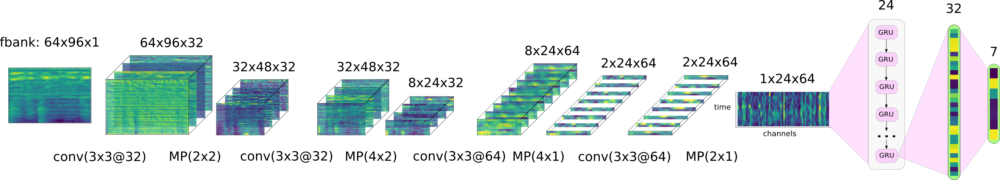

Multi-label MFoM framework for DCASE 2016: Task 4
-------------------------------------------------

[The SIPU Lab / University of Eastern Finland](https://www.uef.fi/web/machine-learning)

[Institute for Infocomm Research / A*Star / Singapore](https://www.a-star.edu.sg/i2r)

Author: **Ivan Kukanov**, [Email](mailto:ivan@kukanov.com), [Homepage](http://www.kukanov.com), [GitHub](https://github.com/vanova)

Supervisor: **Ville Hautamäki**, [Email](mailto:villeh@uef.fi), [Homepage](http://cs.joensuu.fi/~villeh/)
  
Description
===========
This framework represents the implementation of the [maximal figure-of-merit](http://cs.joensuu.fi/~villeh/MFoM-ICASSP2017.pdf) (MFoM) approach 
for multi-label tasks. In particular, it is applied to the [domestic audio tagging task](http://www.cs.tut.fi/sgn/arg/dcase2016/task-audio-tagging) 
 of the DCASE 2016: task 4 challenge. This project represents the solution for the problem of the domestic audio tagging, 
where one audio recording can contain one or more acoustic events and a recognizer
should output all of those tags. 

Organizers provided the baseline system [DCASE 2016 task 4 baseline](https://github.com/pafoster/dcase2016_task4/tree/master/baseline)
with the basic approach: MFCC-based acoustic features and a GMM-based classifier.
Our baseline model is a *convolutional recurrent neural network* (CRNN)
with sigmoid output units optimized using the binary cross-entropy (BCE)
objective. We embed maximal figure-of-merit approach into the deep
learning objective function and gain more than 10% relative
improvement, compared to the baseline model with the binary
cross-entropy.

The proposed MFoM approaches are used in the series of works

* [Maximal Figure-of-Merit Embedding for Multi-label Audio Classification](http://cs.joensuu.fi/~villeh/MFoM-ICASSP2017.pdf)
* [Recurrent Neural Network and Maximal Figure of Merit for Acoustic Event Detection](http://www.cs.tut.fi/sgn/arg/dcase2017/documents/challenge_technical_reports/DCASE2017_Kukanov_196.pdf)
* [Deep learning with Maximal Figure-of-Merit Cost to Advance Multi-label Speech Attribute Detection](http://cs.joensuu.fi/~villeh/slt_2016.pdf)

Installation
============

The system is developed for [Python 2.7](https://www.python.org/). 
Currently, the baseline systems are tested only with Linux operating systems.

You can install the python environment using [Conda](https://conda.io/docs/) and the yml setting file:

`$ conda env create -f envs/conda/ai.py2.yml`

and activate the environment 

`$ source activate ai`

Specifically the project is working with Keras 2.0.2, Tensorflow-GPU 1.4.1.

Usage
=====

The executable file of the project is: `experiments/run_dcase.py`

The system has two pipeline operating modes: *Development mode* and *Submission (or evaluation) mode* (TBD). 

The usage parameters are shown by executing `python run_dcase.py -h`

The system parameters are defined in `experiments/params/dcase.yaml`. 

#### Development mode

In this mode the system is trained and tested within the development dataset. 
This is the default operating mode. To run the system in this mode:

`python run_dcase.py -m dev` or `run_dcase.py -m dev -p params/dcase.yaml`.

System results
==============

* Dataset: ** CHiME-Home-refine --  development set **

* Evaluation setup provided by the organizers of DCASE 16: 5-fold cross-validation, 7 classes.
You can fined folds meta data in `data/dcase_meta/`.

The equal error rate (EER) results per tag:

| Tag                  | GMM baseline | CRNN baseline | CRNN with MFoM |
| -------------------- | ------------ | ------------- | -------------  |
| Adult female speech  | 0.29         | 0.19          | **0.18**           |
| Adult male speech    | 0.30         | 0.13          | **0.11**           |
| Broadband noise      | 0.09         | 0.06          | **0.03**           |
| Child speech         | 0.20         | 0.16          | **0.15**           |
| Other                | 0.29         | 0.25          | **0.23**           |
| Percussive sound     | 0.25         | 0.15          | **0.14**           |
| Video game/tv        | 0.07         | 0.02          | 0.02           |
| **Mean error**       | 0.21         | 0.14          | **0.12**           |

#### The GMM baseline model

Baseline [github](https://github.com/pafoster/dcase2016_task4/tree/master/baseline). 

System main parameters
 
frame size: 20 ms (50% hop size), number of components: 8, 
features: MFCC 14 static coefficients (excluding 0th coefficient)

#### The CRNN baseline model

The baseline model is the convolutional recurrent neural network 

The input features are 64-dimensional log-Mel filter banks spanning from 0 to 16kHz
Context window is the size of 96 frames. We sequentially apply four convolution
mappings and max-pooling along the frequency and time axis. 
Then the result of the convolutions is fed to the gated recurrent unit (GRU) with 24 time steps. 
In all the hidden layers the exponential linear units
(ELUs) are used. Output layer produces sigmoid confidence scores for every acoustic event.
We optimize the binary cross-entropy objective function (BCE) using Adam
optimization algorithm with the learning rate 10−3.  

You can fined the detailed description of the system in the paper 

[Maximal Figure-of-Merit Embedding for Multi-label Audio Classification](http://cs.joensuu.fi/~villeh/MFoM-ICASSP2017.pdf)

#### The MFoM embedding approach with CRNN model

For the CRNN model with MFoM we use the above mentioned baseline CRNN model weights.
The only thing we change is the optimization, we finetune the pre-trained model 
with our proposed MFoM embedding approach. It is implemented in `src/model/objectives.py`
 as `mfom_eer_embed`.
 
 

The MFoM approaches
===================

In this project we release bunch of MFoM approaches. These are MFoM embedding, 
MFoM-microF1, MFoM-EER, MFoM-Cprim. 
These approaches allow to optimize the performance metrics directly 
versus indirect optimization approaches with MSE, cross-entropy, binary cross-entropy
  and other objective functions.

**Note**: the more detailed description will be presented soon.

Changelog
=========

#### 0.0.1 / 2018-09-29

* First public release

License
=======

This software is released under the terms of the [MIT License](./LICENSE).